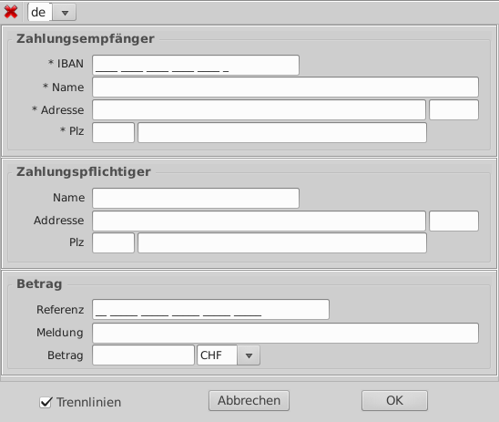
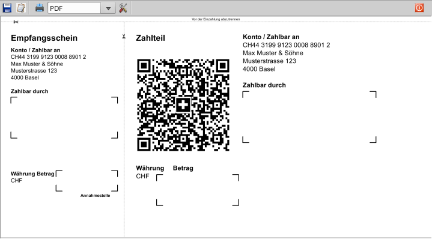
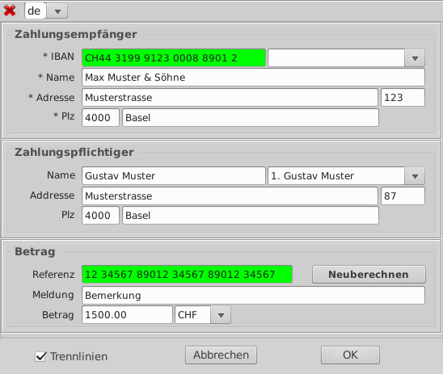

##  Schweizer QR Einzahlungsschein 

### Generieren eines Schweizer QR Einzahlungsscheins

    Kompiliert mit Lazarus für Ubuntu, MacOS und Windows

<!-- TABLE OF CONTENTS -->

  
<h2 style="display: inline-block">:scroll: INHALT</h2>

  <ol>
    <li><a href="#description">Beschreibung</a></li>
    <li><a href="#windows">Fenster</a>
      <ul>
      <li><a href="#windows">Eingabe (Unlizensiert)</a></li>
      <li><a href="#paywindow">Einzahlungsschein</a></li>
      <li><a href="#konten">Eingabe (Lizensiert)</a></li>
      <li><a href="#adresses">Adressen (Lizensiert)</a></li>
      </ul>
    </li>
    <li><a href="#change">Änderungsprotokoll</a></li>
    <li><a href="#license">Lizenz bestellen</a></li>
    <li><a href="#downloads">Download</a></li>
    <li><a href="#nachweise">Einzelnachweise</a></li>
  </ol>

### :mag: Beschreibung

   `qrcode [--swisspay] [--konto=N|--adresse=filename.txt] [--admin] [--jpg] [--print]<Enter>`

   `qrcode [--vcard|wifi|calendar|url|email|phone|sms|geo|youtube]<Enter>`

   `qrcode [--license]<Enter>`

Parameter|Beschreibung
---------|------------
`--swissppay`|Einzahlungsschein Formular öffnen
`--konto=N`|Empfängerkonto auswählen
`--adresse=filename.txt`|Zahlungspflichtige und Empfängerkonto aus Datei lesen
`--admin`|Konten speichern aktivieren
`--jpg`|JPG-Datei erstellen
`--print`|Einzahlungsschein ausdrucken

 Parameter|Beschreibung
---------|------------
`--vcard`|Kontakt code erzeugen
`--wifi`|WIFI code erzeugen
`--calendar`|Kalender code erzeugen
`--url`|URL code erzeugen
`--email`|Email code erzeugen
`--phone`|Telefon code erzeugen
`--sms`|SMS code erzeugen (QRcode mit Handy scannen und senden)
`--geo`|GEO code rezeugen
`--youtube`|Youtube ID code erzeugen

 Parameter|Beschreibung
---------|------------
`--license`|Lizenz eingeben und speichern

:heavy_exclamation_mark: Parameter lassen sich nur mit einer `Lizensierten-Version` ausführen.

:heavy_exclamation_mark: Mit der `Unlizensierte-Version` müssen die Daten `manuell` eingetragen werden.

Wenn `--adresse=` verwendet wird, kann `--konto=` weggelassen werden, da das Konto in der Adressliste enthalten sein muss.
- Linux &nbsp;&nbsp;= ~/qrcode/EZ/rechnung.txt
- MacOS &nbsp;&nbsp;= ~/qrcode/EZ/rechnung.txt
- Windows = %APPDATA%\qrcode\EZ\rechnung.txt

Mit den Parametern `--jpg` und/oder `--print` werden die Daten automatisch verarbeitet und die entsprechenden Daten erzeugt, danach wird das Programm beendet.

Es ist `KEINE Internetverbindung notwendig` zum erzeugen der Einzahlungsscheine.

Daten Verzeichnis für gespeicherte Einzahlungsscheine :
  - Linux `~/qrcode/EZ/` 
  - MacOS `~/qrcode/EZ/` 
  - Windows `%APPDATA%\qrcode\EZ\`

Konfigurationsdatei :
  - Linux `~/qrcode/qrcode.conf` 
  - MacOS `~/qrcode/qrcode.conf` 
  - Windows `HKCU\Software\unattended.ch\QRcode`

   [goto TOC](#toc)

## WINDOWS

[Link : QRCODE Lizenz bestellen](https://unattended.ch/?page_id=1935)

### :computer: Einzahlungsschein Eingabe (Unlizensiert)

:heavy_exclamation_mark: `Mit der Unlizensierten-Version müssen die Daten manuell eingegeben werden.`

  - Nach der Eingabe der IBAN wird die Farbe des Feldes verändert 
    GRÜN=IBAN korrekt 
    ROT&nbsp;&nbsp;&nbsp;=IBAN Fehlerhaft 
  - Nach Eingabe der Referenz wird die Farbe des Feldes verändert 
    GRÜN=Referenz korrekt 
    ROT&nbsp;&nbsp;&nbsp;=Referenz fehlerhaft 
  - \<OK>-Taste erstellt den Einzahlungsschein
  - \<Abbrechen>-Taste Fenster schliessen
  - Es können 4 Sprachen ausgewählt werden en,de,fr,it 
    In diesen Sprachen kann der Einzahlungsschein erstellt werden.

  [goto TOC](#toc)

### :computer: Einzahlungsschein

 Speichern 
 Zwischenablage 
 Drucken 
 Setup 
 Beenden

   [goto TOC](#toc)

### :wrench: Einzahlungsschein Eingabe (Lizensiert)

:heavy_exclamation_mark: `Die Konten können nur mit der Lizensierten-Version gespeichert und geladen werden.`

  - Zahlungsempfänger speichern
    - Die Zahlungsempfänger Kontodaten eintragen und <Speichern> drücken.
    - Danach wird das Konto automatisch in die Auswahlliste geladen
      und kann über diese ausgewählt werden.
    - Es können maximal 8 Konten gespeichert werden.
    - Über die Kommandozeile kann man das Konto mit --konto=N (1=Eins,2=Zwei...) auswählen.
  
  - Nach der Eingabe der IBAN wird die Farbe des Feldes verändert
    - GRÜN=IBAN korrekt 
    - ROT&nbsp;&nbsp;&nbsp;=IBAN Fehlerhaft 
 
  - Nach Eingabe der Referenz wird die Farbe des Feldes verändert
    - GRÜN=Referenz korrekt 
    - ROT&nbsp;&nbsp;&nbsp;=Referenz fehlerhaft
  
  - Um eine eigene Referenznummer zu erstellen, muss die Nummer eigegeben werden. 
    Und dann kann mit <Neuberechnen> die Prüfziffer berechnet werden. 
    - 12 34567 89012 34567 89012 3456`0`
    - PK`00` 1234 5678 9012 3456 7890 1
  
  - \<OK>-Taste erstellt den Einzahlungsschein
  - \<Abbrechen>-Taste Fenster schliessen

  - Es können 4 Sprachen ausgewählt werden en,de,fr,it 
    In diesen Sprachen kann der Einzahlungsschein erstellt werden.

[goto TOC](#toc)

### :wrench: Adressen (Lizensiert)

:heavy_exclamation_mark: `Die Adressen können nur mit der Lizensierten-Version aus einer Textdatei geladen werden.`

  - Dazu muss jeder Datensatz aus 10 Zeilen bestehen.
  - Falls mehr als 1 Datensatz übertragen werden soll, muss eine Trennzeile `###` eingesetzt werden.
  - Als Abschluss muss eine Leerzeile folgen.
  - Über die Kommandozeile kann man die Datei mit --adresse=filename.txt laden.
  - Es können maximal 64 Adressen verarbeitet werden.
  - Alle Zeilen mit `***` müssen ausgefüllt sein, alle anderen können leer sein.
 

  Aufbau :

	 1. Empfänger Konto (1=Eins,2=Zwei...) ***
	 2. Name
	 3. Adresse
	 4. Hausnummer
	 5. Postleitzahl
	 6. Ort
	 7. Referenznummer
	 8. Bemerkung
	 9. Währung (CHF/EUR) ***
	10. Betrag
	11. Leerzeile oder Trenzeile '###' ***

Datei adressen.txt :

<pre>
1
Gustav Muster
Musterstrasse
87
4000
Basel
00 00000 00000 00000 00000 00000
Bemerkung
CHF
1500.00
###
1
Frank Muster
Musterstrasse
22
4000
Basel
00 00000 00000 00000 00000 00000
Bemerkung
CHF
999.00

</pre>

   [goto TOC](#toc)

## :recycle: Änderungsprotokoll
[Changelog](/CHANGELOG)

### :warning: Lizenz bestellen

[Lizenz bestellen](https://unattended.ch/?page_id=1935)

### :dvd: Download

### Einzelnachweise
[Wikipedia QR-Rechnung](https://de.wikipedia.org/wiki/QR-Rechnung) abgerufen am 15. Januar 2023 
[Wikipedia QR-Code](https://de.wikipedia.org/wiki/QR_code) abgerufen am 15. Januar 2023 
[SIX Style Guide](https://www.paymentstandards.ch/dam/downloads/style-guide-de.pdf) abgerufen am 15. Januar 2023

   [goto TOC](#toc)

